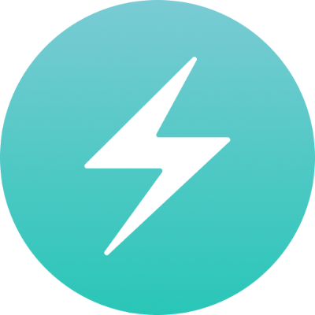

- 👋 Hi, I’m @Yogeshvari2902
- 👀 I’m interested in ...
- 🌱 I’m currently learning ...
- 💞️ I’m looking to collaborate on ...
- 📫 How to reach me ...

<h1>Hi 🖐️ there! Good to see you. </h1>

<h2>Welcome to my Github space!</h2>
<h3>I'm Yogeshvari Suryawanshi, Full stack developer from Madhya Pradesh, India.</h3>

➡️ <a href="https://drive.google.com/file/d/1iDQE_OtCW025GJtOfhhDqgDNF2DVo8JC/view?usp=sharing">RESUME 📃</a>↔
<a href="#">PORTFOLIO 🖥️</a>

<h3>Socials</h3>

<h3>Email : yogeshvari2022@gmail.com</h3>

<h3>Tech stack that I know : </h3>

<!--  -->

<!--  -->

<h3>Stats 📊 : </h3>

<h3>GitHub Stat Trophies</h3>

<h3>Streak Stats : </h3>
  

<!---
Yogeshvari2902/Yogeshvari2902 is a ✨ special ✨ repository because its `README.md` (this file) appears on your GitHub profile.
You can click the Preview link to take a look at your changes.
--->
